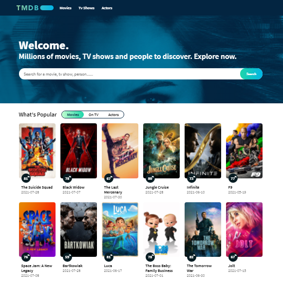

# The Movie App

A Simple vue application to display Movies, TV Shows and Actors Information.



# Features

- List 12 Popular Movies, TV Shows and Actors
- List 12 Today Trending and This Week Trending
- View Movies, TV Shows and Actors Details
- View Movies, TV Shows and Actors Details

## Installation

Clone the project. (https://github.com/mertaktas/Vuejs-TheMovieApp.git)

```

git clone https://github.com/mertaktas/Vuejs-TheMovieApp.git
```

## Usage

After cloning the project, open it in the IDE.

```

cd kodluyoruzilkrepo
code .
```

## Project setup

Installation of the project

```
npm install
```

### Compiles and hot-reloads for development
```
npm run serve
```

### Compiles and minifies for production
```
npm run build
```

### Customize configuration
See [Configuration Reference](https://cli.vuejs.org/config/).

## License
[MIT](https://choosealicense.com/licenses/mit/)
